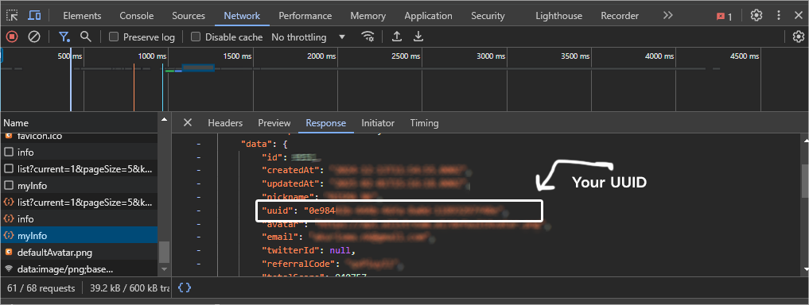

# 🚀 MinionLab Depin  
**Mine Data, Fuel AI, Earn Rewards – Join the MinionLab Revolution!**  

  

## 🌐 Official Links  
🔗 **Website:** [MinionL](https://ref.minionlab.io/?referralCode=VJKKXCPU)  
🐦 **Twitter/X:** [@MinionLabAI](https://x.com/MinionLabAI)  

---  

## ✨ Features  

✅ **Auto Create Connections/Devices**  
✅ **Support Multiple Accounts**  
✅ **Supports Proxy** (Format: `http://ip:port` or `http://username:password@ip:port`)  
✅ **Maximum 100 devices (same IP allowed) per Account** 

---  

## 📌 Requirements  

🔹 **Node.js**: Ensure Node.js is installed.  
🔹 **NPM**: Ensure npm is installed.  
🔹 **MinionLab ID**: Follow the instructions below to retrieve your ID.  

1️⃣ **Create an MinionLab account**: [Sign Up Here](https://ref.minionlab.io/?referralCode=VJKKXCPU)  
2️⃣ **Open Developer Tools** (`F12`) after logging in.  
3️⃣ **Go to the "Network" tab** and search for **MyInfo**.  
4️⃣ **Copy your ID** from the response.  

  

---  

## ⚡ Setup  

### 1️⃣ Clone the repository  
```bash  
git clone https://github.com/lrmn7/minionlab.git  
cd minionlab  
```  

### 2️⃣ Install dependencies  
```bash  
npm install  
```  

### 3️⃣ Add User IDs  
Edit `uuid.txt` and paste your user IDs (one per line):  
```bash  
nano uuid.txt  
```  

### 4️⃣ Add Proxy List  
Edit `proxy.txt` and paste proxies (one per line):  
```bash  
nano proxy.txt  
```  

### 5️⃣ Run the script  
```bash  
npm run start  
```  

🔥 **Start mining data and earning rewards with MINION LAB AI today!** 🚀  
